# Kingsley Documentation of Project 9 
## Project 9 - Continous Integration Pipeline For Tooling Website
### INSTALL AND CONFIGURE JENKINS SERVER
### Step 1 -Install Jenkins server

1. Create an AWS EC2 server based on Ubuntu Server 20.04 LTS and name it “Project9-Jenkins”.

	

2. Install JDK (since Jenkins is a Java-based application).

`sudo apt update`

`sudo apt install fontconfig openjdk-17-jre`

`java -version`

3. Install Jenkins

`sudo wget -O /usr/share/keyrings/jenkins-keyring.asc \
  https://pkg.jenkins.io/debian-stable/jenkins.io-2023.key`

  `echo deb [signed-by=/usr/share/keyrings/jenkins-keyring.asc] \
  https://pkg.jenkins.io/debian-stable binary/ | sudo tee \
  /etc/apt/sources.list.d/jenkins.list > /dev/null`

  `sudo apt-get update`

   `sudo apt-get install jenkins`

   `sudo systemctl status jenkins`

   

4. By default Jenkins server uses TCP port 8080 – open it by creating a new Inbound Rule in your EC2 Security Group

 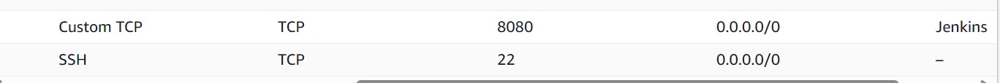

5. Perform initial Jenkins setup.

[jenkins server browser status](http://100.26.20.73:8080)

 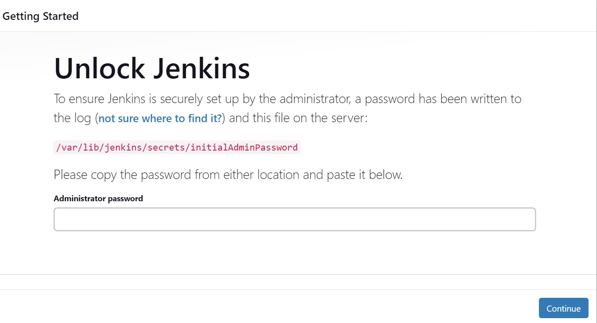

 *Retrieve password it from your server*

 `sudo cat /var/lib/jenkins/secrets/initialAdminPassword`

  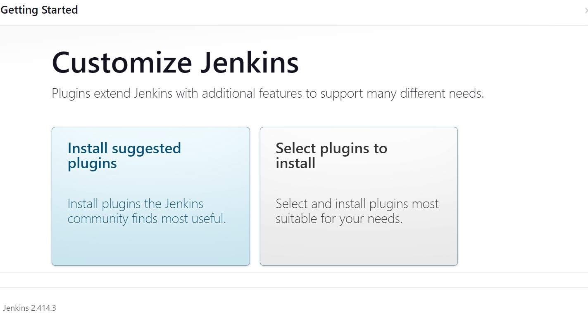

  *Once plugins installation is done – create an admin user and you will get your Jenkins server address*
  ### The installation is completed!

   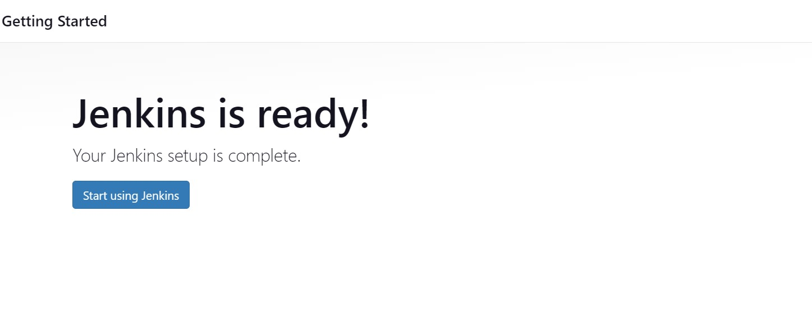

   ### Step 2 – Configure Jenkins to retrieve source codes from GitHub using Webhooks.

   1. Enable webhooks in your GitHub repository settings

   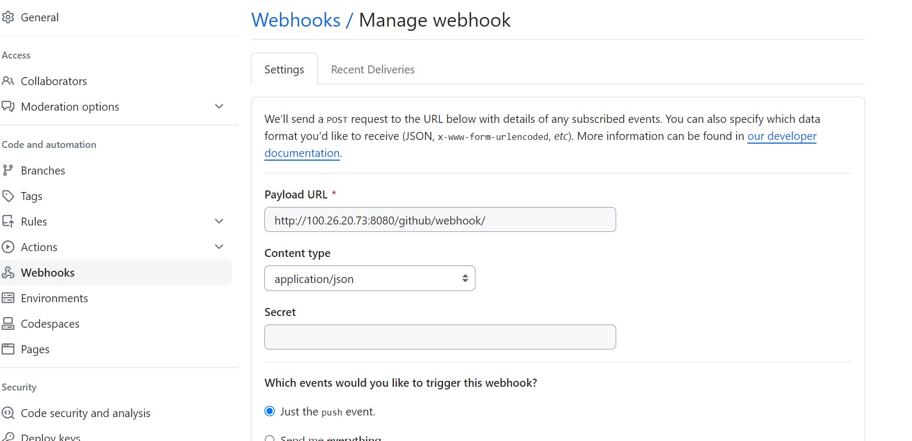

   2. Go to Jenkins web console, click “New Item” and create a “Freestyle project”

   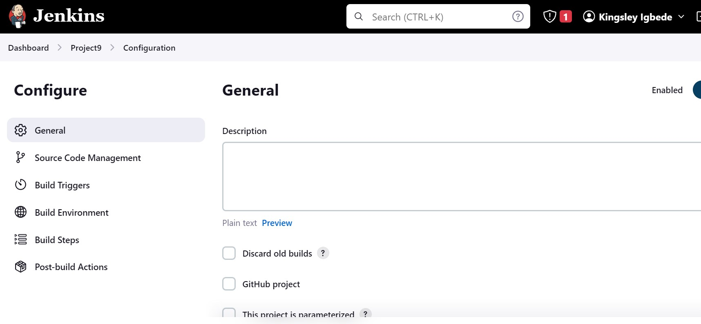

   3. To connect your GitHub repository, you will need to provide its URL, you can copy from the repository itself

   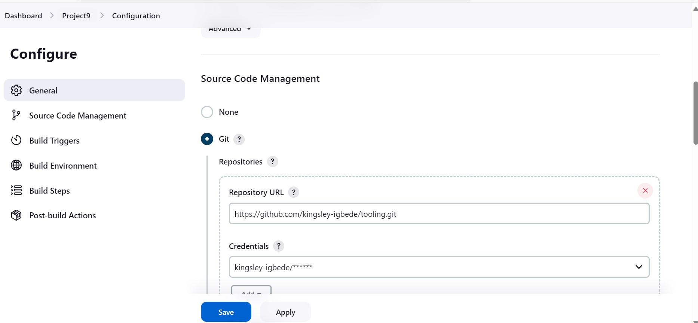

   *Save the configuration and let us try to run the build. For now we can only do it manually.
Click “Build Now” button, if you have configured everything correctly, the build will be successfull and you will see it under #1*

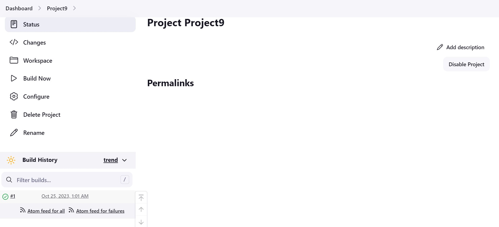

*Now open the build and check in “Console Output” if it has run successfully*

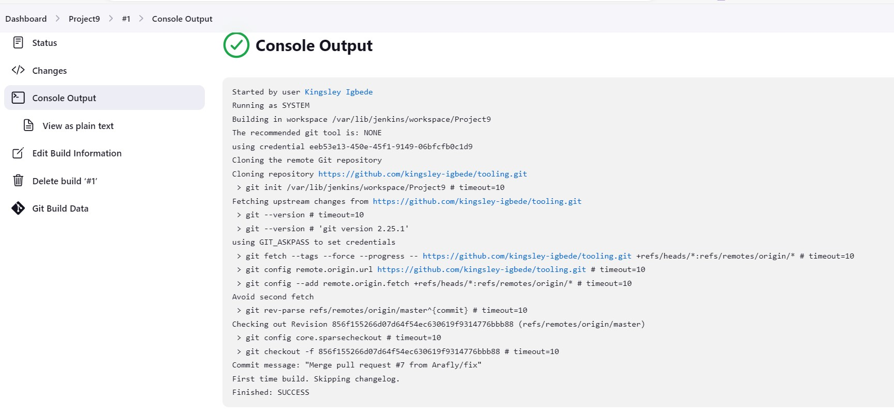

*But this build does not produce anything and it runs only when we trigger it manually. Let us fix it*

4. Click “Configure” your job/project and add these two configurations

*Configure triggering the job from GitHub webhook*

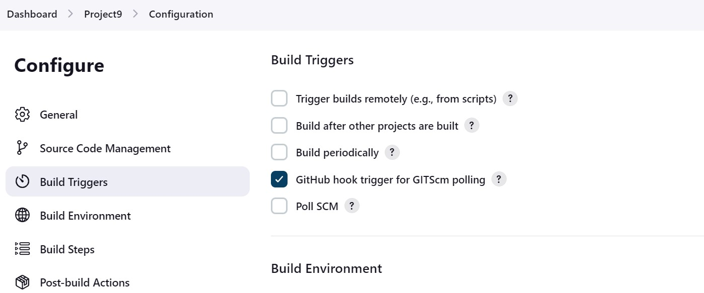

*Configure “Post-build Actions” to archive all the files – files resulted from a build are called “artifacts”*

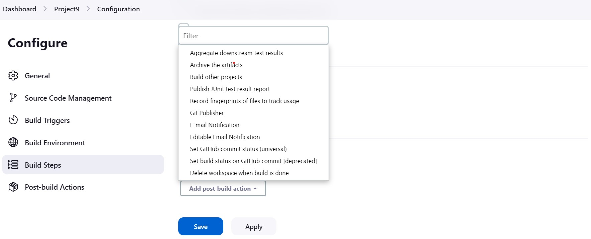

