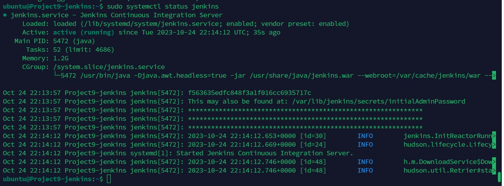

# Kingsley Documentation of Project 9 
## Project 9 - Continous Integration Pipeline For Tooling Website
### INSTALL AND CONFIGURE JENKINS SERVER
### Step 1 -Install Jenkins server

1. Create an AWS EC2 server based on Ubuntu Server 20.04 LTS and name it “Project9-Jenkins”.

	

2. Install JDK (since Jenkins is a Java-based application).

`sudo apt update`

`sudo apt install fontconfig openjdk-17-jre`

`java -version`

`sudo wget -O /usr/share/keyrings/jenkins-keyring.asc \
  https://pkg.jenkins.io/debian-stable/jenkins.io-2023.key`

  `echo deb [signed-by=/usr/share/keyrings/jenkins-keyring.asc] \
  https://pkg.jenkins.io/debian-stable binary/ | sudo tee \
  /etc/apt/sources.list.d/jenkins.list > /dev/null`

  `sudo apt-get update`

   `sudo apt-get install jenkins`

   `sudo systemctl status jenkins`

   

   

