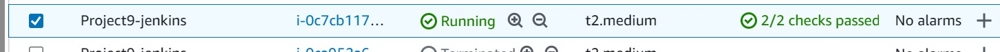

# Kingsley Documentation of Project 9 
## Project 9 - Continous Integration Pipeline For Tooling Website
### INSTALL AND CONFIGURE JENKINS SERVER
### Step 1 -Install Jenkins server

1. Create an AWS EC2 server based on Ubuntu Server 20.04 LTS and name it “Project9-Jenkins”.

	

2. Install JDK (since Jenkins is a Java-based application).

